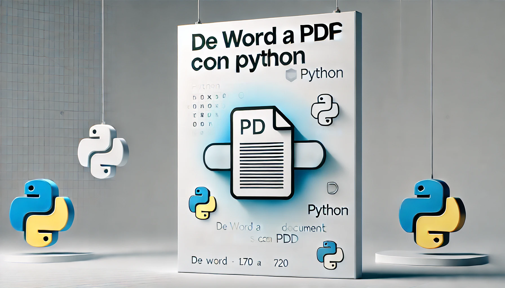

## 🎯 Objetivo del Proyecto
En este tutorial, aprenderemos a desarrollar una **aplicación de escritorio multiplataforma** que convierte archivos de **Microsoft Word (.docx)** a **PDF** de manera rápida y eficiente. Utilizaremos **Python**, **Tkinter** para la interfaz gráfica y la librería **docx2pdf** para realizar la conversión de documentos.

## 📋 Índice de Contenidos
- Introducción
- Requisitos Previos
- Análisis de Librerías
- Estructura del Código
- Desarrollo Paso a Paso
- Desglose de Funciones
- Mejores Prácticas
- Posibles Mejoras



🌟 **Introducción**

### Contexto del Proyecto
En el mundo profesional y académico, las **conversiones de documentos** son tareas frecuentes. Mientras que **Microsoft Word** es excelente para editar y crear documentos, el formato **PDF** se ha convertido en el estándar para los documentos finales, ya que preserva el formato y es universalmente compatible. Este proyecto se enfoca en **automatizar** la conversión de archivos Word a PDF de una manera **sencilla** y **eficiente**.
## Problemática Resuelta
- **Conversión manual de documentos**: La conversión manual de archivos Word a PDF es tediosa y consume tiempo.
- **Pérdida de tiempo en transformaciones**: Sin una herramienta automática, las conversiones se vuelven lentas y repetitivas.
- **Necesidad de herramientas rápidas y amigables**: Los usuarios necesitan aplicaciones fáciles de usar que agilicen este proceso y aumenten su productividad.

## 🔧 Requisitos Previos

### Entorno de Desarrollo
- **Python 3.7+**: Este lenguaje de programación es perfecto para aplicaciones rápidas y multiplataforma.
- **Sistema Operativo**: Windows (preferentemente), aunque la aplicación es compatible con otros sistemas operativos.
- **Conocimientos Básicos**:
  - **Programación en Python**: Debes tener conocimientos básicos de Python.
  - **Manejo de interfaces gráficas**: Tkinter es nuestra herramienta principal para la GUI.
  - **Conceptos de conversión de documentos**: Familiarízate con la idea de convertir formatos de archivos.

### Librerías Necesarias
Para llevar a cabo este proyecto, necesitas instalar las siguientes librerías:
- `pip install tkinter`
- `pip install docx2pdf`
- `pip install pywin32`

## 📚 Análisis de Librerías

### Tkinter
- **Librería estándar para interfaces gráficas en Python**.
- **Multiplataforma**: Funciona en Windows, macOS y Linux.
- **Componentes nativos**: Utiliza componentes gráficos nativos del sistema operativo.
- **Fácil implementación**: Ideal para aplicaciones sencillas con interfaz gráfica.

### Docx2pdf
- **Conversión directa de archivos Word (.docx) a PDF**.
- **Utiliza componentes de Microsoft Office** para la conversión.
- **Alto rendimiento**: Procesa documentos rápidamente sin perder calidad.
- **Preservación de formato**: Mantiene el formato original del documento.

### Pythoncom
- **Gestión de componentes COM de Windows**.
- **Inicialización de procesos de conversión**: Permite interactuar con Microsoft Word desde Python.
- **Manejo de recursos de Microsoft Office**: Facilita la conversión de documentos en un entorno Windows.

## 🏗️ Estructura del Código

### Módulos Principales
- **Importaciones**: Se importa todo lo necesario para la gestión de archivos, la interfaz gráfica y la conversión.
- **Funciones**: Implementaremos funciones para seleccionar archivos, convertir documentos y gestionar el progreso.
- **Interfaz Gráfica**: Crear la ventana principal, botones interactivos y visualización del progreso.

## 🧩 Desarrollo Paso a Paso

### 1. Configuración Inicial
Comenzamos importando las librerías necesarias:

```python
# Importaciones necesarias
import os  # Manejo de rutas y archivos
import tkinter as tk  # Interfaz gráfica
from tkinter import filedialog, messagebox, ttk  # Diálogos y componentes
from docx2pdf import convert  # Conversión Word a PDF
import pythoncom  # Inicialización de componentes COM
## 📚 Explicación de Importaciones
- **os**: Nos ayuda a gestionar las rutas y los archivos.
- **tkinter**: Utilizamos esta librería para crear la interfaz gráfica.
- **filedialog y messagebox**: Sirven para mostrar mensajes y seleccionar archivos.
- **docx2pdf**: Realiza la conversión de archivos de Word a PDF.
- **pythoncom**: Inicializa y limpia los procesos de conversión relacionados con COM.
```

### Función de Conversión

A continuación, implementamos la función para convertir el archivo Word a PDF:

```python
def convert_docx_to_pdf(docx_file, pdf_path, progress_bar, progress_var, total_files, current_file):
    try:
        # Inicialización de librería COM
        pythoncom.CoInitialize()

        # Validaciones previas
        if not os.path.exists(docx_file) or os.path.getsize(docx_file) == 0:
            messagebox.showerror("Error", f"Archivo {docx_file} inválido")
            return

        # Crear directorio de salida si no existe
        os.makedirs(os.path.dirname(pdf_path), exist_ok=True)

        # Conversión
        convert(docx_file, pdf_path)
        
        # Actualizar barra de progreso
        progress_var.set((current_file / total_files) * 100)
        progress_bar.update_idletasks()

    except Exception as e:
        messagebox.showerror("Error", f"Conversión fallida: {e}")
    finally:
        # Liberar recursos COM
        pythoncom.CoUninitialize()
```


## 🧑‍💻 Explicación:

- Se inicializa la librería COM para permitir la interacción con Microsoft Word.
- Validamos que el archivo no esté vacío y que exista.
- Realizamos la conversión utilizando la función `convert` de la librería `docx2pdf`.
- Actualizamos la barra de progreso durante el proceso de conversión.
- Finalmente, liberamos los recursos COM para evitar fugas de memoria.

## 🖥️ Implementación de Interfaz Gráfica

Ahora, creamos la interfaz de usuario para seleccionar los archivos y ejecutar la conversión:

## 🖥️ Crear ventana principal

```python
root = tk.Tk()

root.title("Conversor Word a PDF")

root.geometry("700x750")
```

## 🛠️ Elementos de interfaz

```python

title_label = tk.Label(root, text="Conversor de Documentos", font=("Arial", 16))

select_files_button = tk.Button(root, text="Seleccionar Archivos", command=select_files)

file_listbox = tk.Listbox(root, width=50, height=6)

convert_button = tk.Button(root, text="Convertir", command=convert_files)
```

## 📝 Explicación:

Ventana principal: Configuramos el tamaño y el título de la ventana para que sea visualmente atractiva y fácil de usar.
Botones y listas: Creamos botones para seleccionar archivos y convertir, y una lista para mostrar los archivos seleccionados de manera ordenada y accesible.


## 📚 Desglose de Secciones:

- **Importaciones**: Se detallan las librerías necesarias para el funcionamiento de la aplicación.
- **Funciones**: Se explican las funciones clave implementadas para la conversión y la actualización del progreso.
- **Interfaz Gráfica**: Se describe el diseño de la ventana principal, los botones interactivos y los elementos visuales.

## 🔧 Mejores Prácticas:

- **Manejo de Errores**: La aplicación muestra mensajes de error si un archivo no es válido o si la conversión falla, lo que garantiza que el usuario reciba una retroalimentación clara.
- **Liberación de Recursos**: Se asegura de liberar los recursos de `pythoncom` después de cada conversión para evitar fugas de memoria y mantener el rendimiento de la aplicación.
- **Interfaz Amigable**: La interfaz utiliza componentes sencillos y directos para facilitar la interacción del usuario, asegurando una experiencia de usuario intuitiva.

## 🚀 Posibles Mejoras:

- **Soporte multiplataforma**: Incorporar soporte para sistemas operativos como Linux y macOS.
- **Agregar la conversión de otros tipos de archivos**: Ampliar la funcionalidad para soportar más formatos de archivos (ej. .txt, .rtf).
- **Incluir un modo por lotes**: Permitir la conversión de múltiples archivos en un solo proceso, sin intervención manual, para mejorar la eficiencia.

## 🚀 Código Completo

```python

# Importaciones necesarias
import os  # Manejo de rutas y archivos
import tkinter as tk  # Interfaz gráfica
from tkinter import filedialog, messagebox, ttk  # Diálogos y componentes
from docx2pdf import convert  # Conversión Word a PDF
import pythoncom  # Inicialización de componentes COM

# Función para seleccionar archivos
def select_files():
    files = filedialog.askopenfilenames(filetypes=[("Archivos Word", "*.docx")])
    if files:
        for file in files:
            file_listbox.insert(tk.END, file)

# Función para convertir archivos seleccionados
def convert_files():
    files = file_listbox.get(0, tk.END)
    if not files:
        messagebox.showwarning("Advertencia", "No se han seleccionado archivos.")
        return

    # Crear directorio de salida para los PDFs
    output_dir = filedialog.askdirectory(title="Seleccionar directorio de salida")
    if not output_dir:
        return

    total_files = len(files)
    progress_var.set(0)
    progress_bar["maximum"] = 100

    for index, docx_file in enumerate(files, start=1):
        pdf_path = os.path.join(output_dir, os.path.basename(docx_file).replace(".docx", ".pdf"))
        convert_docx_to_pdf(docx_file, pdf_path, progress_bar, progress_var, total_files, index)

# Función de Conversión
def convert_docx_to_pdf(docx_file, pdf_path, progress_bar, progress_var, total_files, current_file):
    try:
        # Inicialización de librería COM
        pythoncom.CoInitialize()

        # Validaciones previas
        if not os.path.exists(docx_file) or os.path.getsize(docx_file) == 0:
            messagebox.showerror("Error", f"Archivo {docx_file} inválido")
            return

        # Crear directorio de salida si no existe
        os.makedirs(os.path.dirname(pdf_path), exist_ok=True)

        # Conversión
        convert(docx_file, pdf_path)
        
        # Actualizar barra de progreso
        progress_var.set((current_file / total_files) * 100)
        progress_bar.update_idletasks()

    except Exception as e:
        messagebox.showerror("Error", f"Conversión fallida: {e}")
    finally:
        # Liberar recursos COM
        pythoncom.CoUninitialize()

# Crear ventana principal
root = tk.Tk()

root.title("Conversor Word a PDF")

root.geometry("700x750")

# Elementos de interfaz

title_label = tk.Label(root, text="Conversor de Documentos", font=("Arial", 16))
title_label.pack(pady=10)

select_files_button = tk.Button(root, text="Seleccionar Archivos", command=select_files)
select_files_button.pack(pady=5)

file_listbox = tk.Listbox(root, width=50, height=6)
file_listbox.pack(pady=5)

convert_button = tk.Button(root, text="Convertir", command=convert_files)
convert_button.pack(pady=20)

# Barra de progreso
progress_var = tk.DoubleVar()
progress_bar = ttk.Progressbar(root, variable=progress_var, length=400)
progress_bar.pack(pady=10)

# Iniciar la interfaz gráfica
root.mainloop()

```

## 🛡️ Mejores Prácticas

- **Manejo de errores**: Siempre valida entradas y gestiona excepciones para mejorar la experiencia del usuario.
- **Liberación de recursos**: Asegúrate de liberar los recursos de la librería COM al finalizar el proceso.
- **Interfaz amigable**: Utiliza colores y tamaños de fuente adecuados para hacer la aplicación fácil de usar.
- **Retroalimentación al usuario**: Usa mensajes para indicar el progreso y los errores.

## 🚀 Posibles Mejoras

- **Soporte multiplataforma**: Mejorar la compatibilidad para macOS y Linux.
- **Conversión de otros formatos**: Incluir la conversión de otros tipos de archivos, como imágenes o presentaciones.
- **Modo por lotes**: Agregar la capacidad de convertir varios archivos simultáneamente sin necesidad de interacción manual.


Mantén siempre actualizadas las librerías utilizadas en el proyecto.
Realiza pruebas exhaustivas en diferentes entornos de trabajo.
Considera las necesidades específicas de los usuarios al diseñar la interfaz.

# 📄➡️ Guía de Instalador de Conversor Word a PDF 🖥️
Guía completa para crear un instalador distribuible para una aplicación de escritorio que convierte archivos de Microsoft Word a PDF, utilizando Python, PyInstaller e Inno Setup.

## 🛠️ Requisitos Previos
- Python instalado

- Conocimientos básicos de desarrollo en Python

- Sistema operativo Windows

## 🚀 Pasos de Instalación

### 1. 🧱 Preparar el Proyecto
- Asegúrate de que app.py esté completo y funcional

- Verifica que todas las dependencias estén instaladas

```bash

pip install docx2pdf pywin32 tkinter

```

### 2. 📦 Instalar PyInstaller
pip install pyinstaller


### 3. 🔨 Generar Ejecutable
pyinstaller --onefile --noconsole --add-data "ruta_a_tus_iconos_y_archivos;." app.py`
#### Explicación de Banderas de PyInstaller:
- --onefile: Crea un único archivo ejecutable

- --noconsole: Evita que se abra la consola de terminal (para aplicaciones con interfaz gráfica)

- --add-data: Incluye archivos adicionales como íconos o configuraciones

### 4. 🕵️ Probar Ejecutable
- Navega a la carpeta dist

- Ejecuta el archivo .exe para confirmar su funcionamiento

### 5. 🔧 Instalar Inno Setup
- Descarga desde el [Sitio Oficial de Inno Setup](https://jrsoftware.org/isinfo.php)

- Sigue las instrucciones de instalación

### 6. 📝 Crear Script de Inno Setup
- Abre Inno Setup

- Crea un nuevo script

- Configura con la plantilla proporcionada

### 7. 🏗️ Generar Instalador
- Guarda el script de Inno Setup

- Haz clic en "Compilar"

- El instalador se generará en la carpeta especificada

### 8. 🧪 Probar Instalador
- Ejecuta el instalador .exe generado

- Verifica la instalación y funcionamiento de la aplicación

## 🌐 Distribución
¡Tu instalador está listo para distribuirse a usuarios sin Python instalado!

## 🔑 Beneficios Principales
- 🚫 No requiere instalación de Python para usuarios finales

- 📦 Ejecutable único y compacto

- 🖥️ Proceso de instalación sencillo

- 🌈 Instalador de aspecto profesional

## 🤝 Contribuciones
- Abierto a mejoras y sugerencias

- No dudes en abrir issues o enviar pull requests

## ⚠️ Solución de Problemas
- Asegúrate de que todas las dependencias estén correctamente instaladas

- Verifica la compatibilidad de versiones de Python y PyInstaller

- Comprueba que la aplicación funcione antes de crear el instalador

## 💡 Consejos Profesionales
- Prueba a fondo antes de distribuir

- Mantén las dependencias al mínimo

- Proporciona instrucciones de instalación claras

- Considera agregar un ícono para un toque profesional


💻✨ #DesarrolloDeSoftware #Python #Automatización #AplicacionesDeEscritorio #Tecnología #Innovación #Productividad #PyInstaller #InnoSetup #Emprendimiento #Desarrollador #Programación #TechCommunity #ProductividadDigital #TransformaciónDigital #SolucionesTecnológicas #Aplicaciones #Desarrolladores

